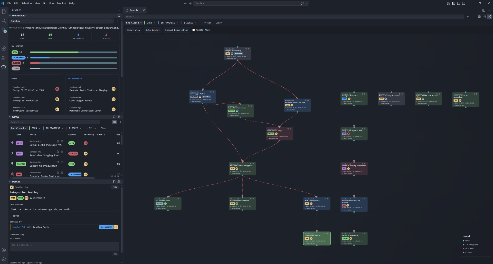
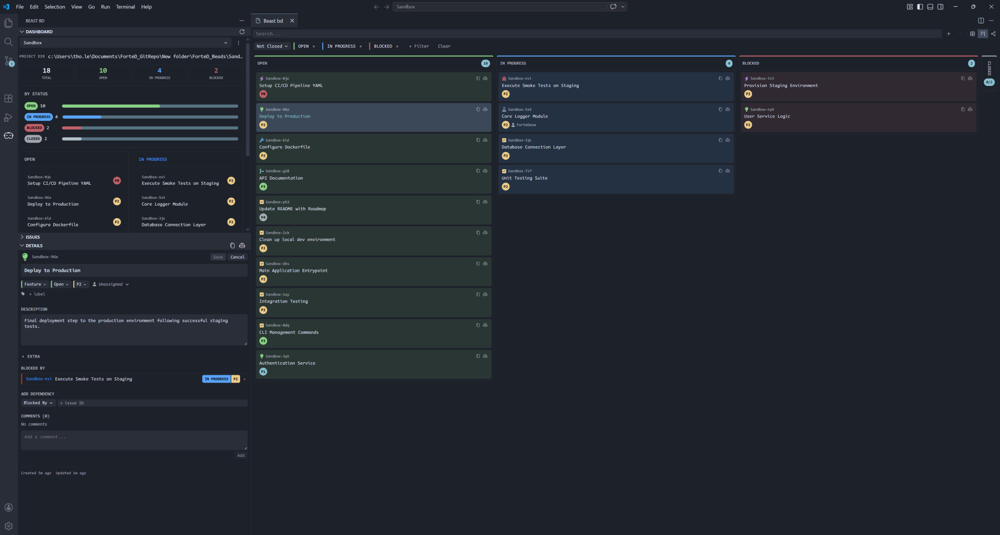
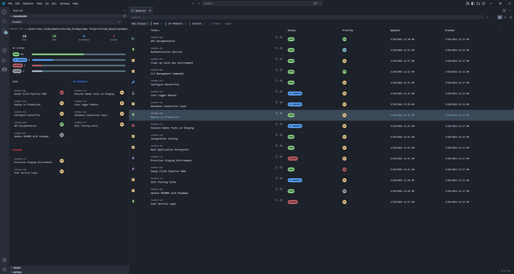

<table>
  <tr>
    <td></td>
    <td>
      <h1>[Beast bd] - VSCode Extension</h1>
      
This extension uses <a href="https://github.com/steveyegge/beads">Beads</a>.

      
Fork from <a href="https://github.com/jdillon/vscode-beads">vscode-beads</a> ❤️.

    </td>
  </tr>
</table>

## Features:
- YES!

